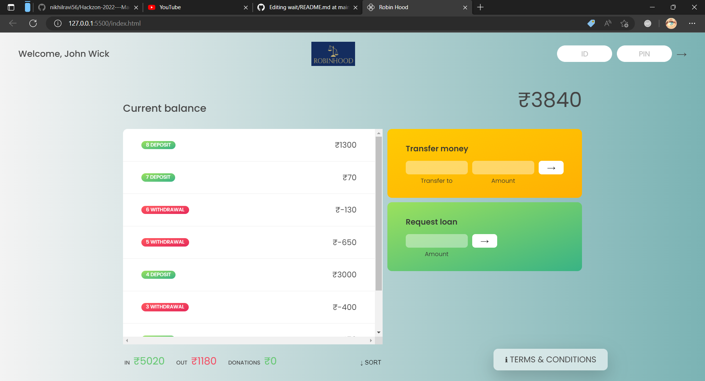
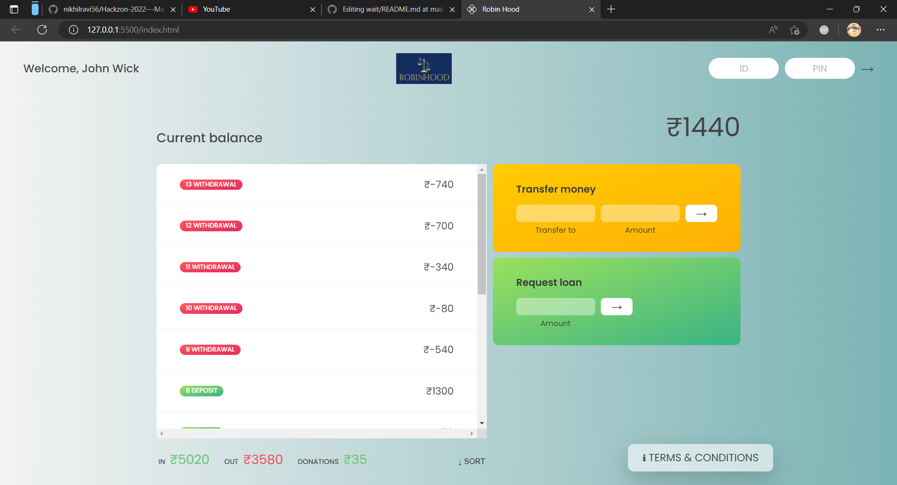

# Robin-Hood

Brief Description and Introduction to the idea and project of the hackathon:

With this project we take a small amount on every transaction that happens through this gateway (Max of Rs.10/-) by rounding off the amount spent to the nearest 10.The user of the interface can also request for loans or close the account through this interface.

Steps of execution of the project:

1.Start of the Application.
2.Login with user credentials.
3.To transfer the money, enter the recepient's username and amount to be transferred.
4.To request for a loan, enter the amount to be requested.
5.To close the acccount, enter the user name and the password associated with the username.
6.Close the application.

Screen Shots of the website:

1. Home Page

2. Transaction

3. Donation  

